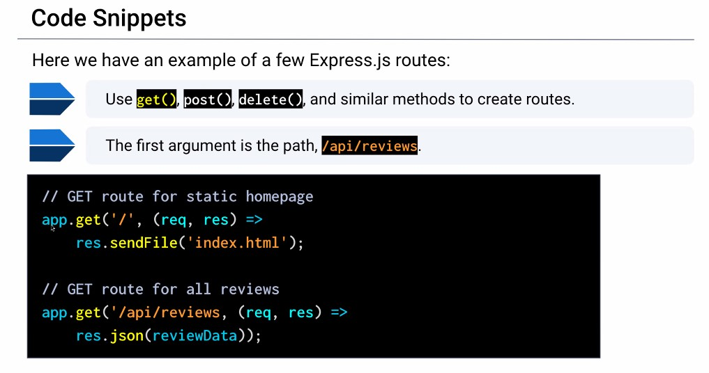
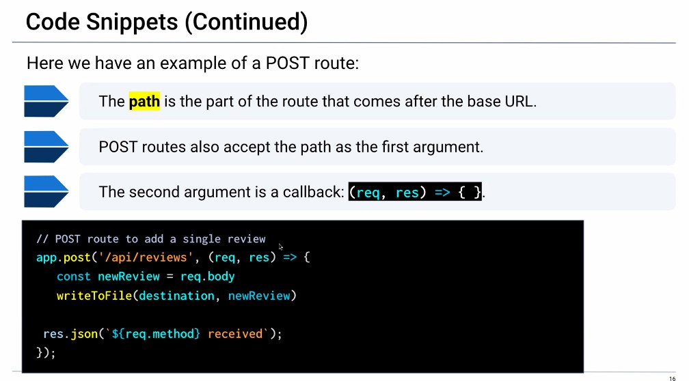
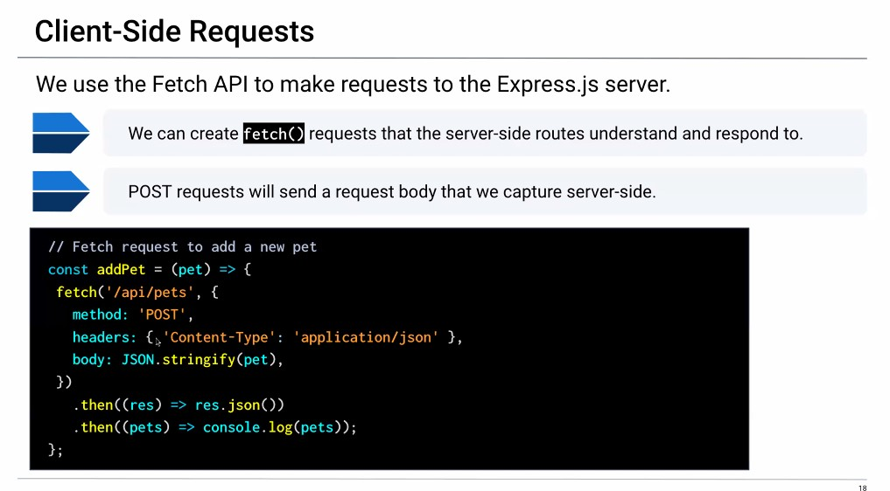
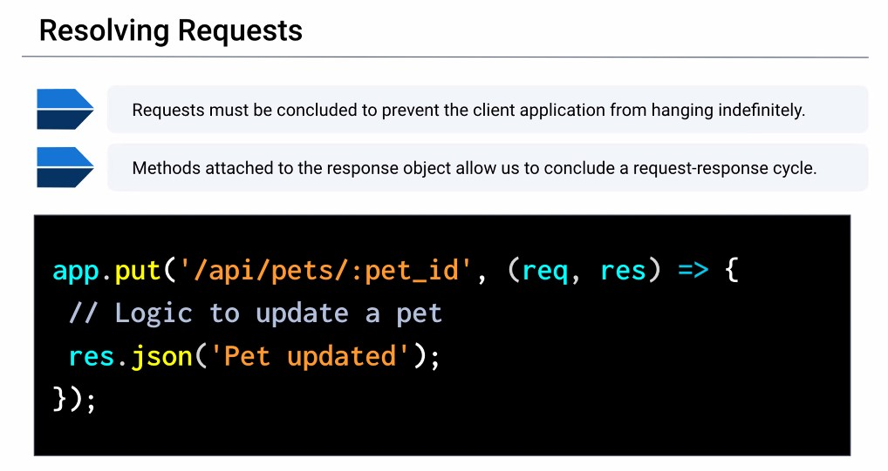

# Express.js

- a lightweight framework for node.js that allows you to write APIs
- it exists on the back end of an application

## What is a route?

- a lot like traffic lanes at an airport. Certain lanes are designated for dropping people off, picking up passengers, picking up luggage, and so on.
- Routes allow us to send and receive data depending on which route and HTTP method we use. A route can be used for different kinds of requests, to create, read, update, and delete data.

## What is a restful API?

- REST or representational state transfer, is an architecture for creating a web service like an API
- RESTful APIs must meet the following criteria:
  - comprise clients, servers, resources and requests via HTTP
  - use stateless communications between client and server
  - serve cached objects to reduce bandwidth
  - maintain a uniform interface between the client and the server sot hat they can evolve separately
  - optionally, can perform code on demand

## What are HTTP methods?

- post: Submits data to the specified resource, often causing a change on the server
- get: retrieves a resource from the server
- delete: deletes a specified resource
- put/patch: replaces a specified resource with a payload

## What does the code look like?

